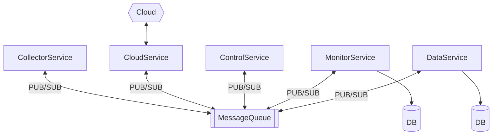
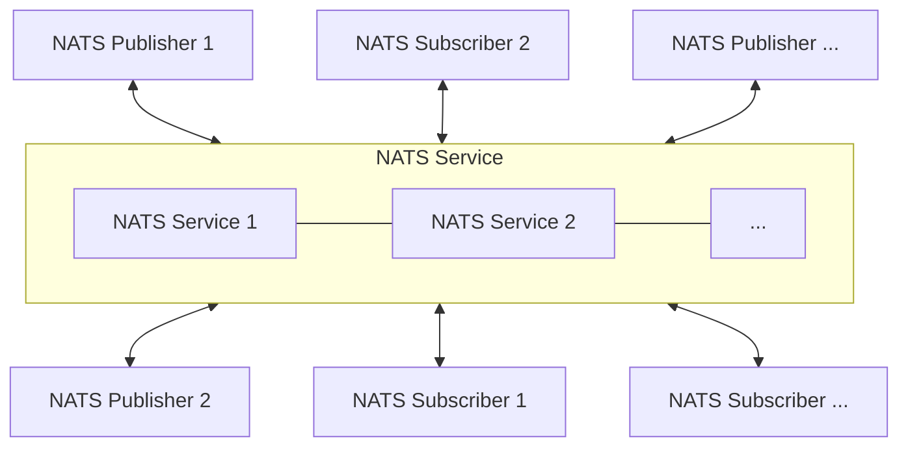
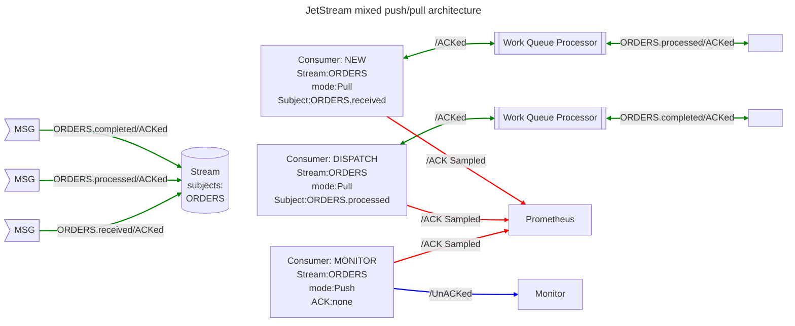
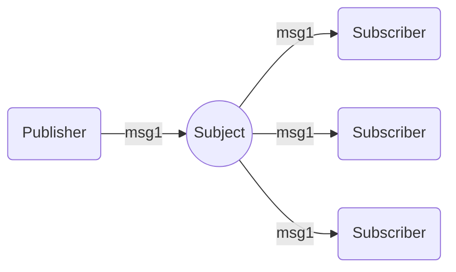
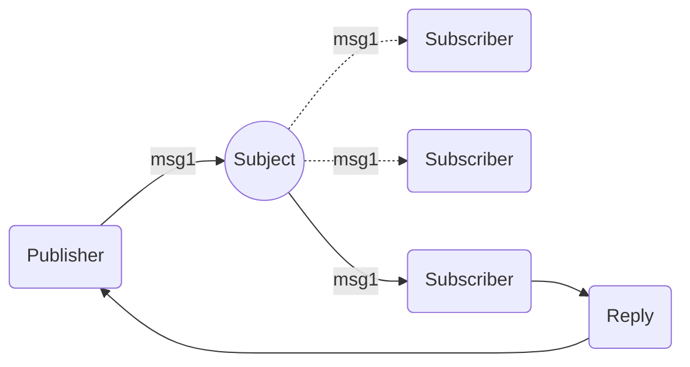
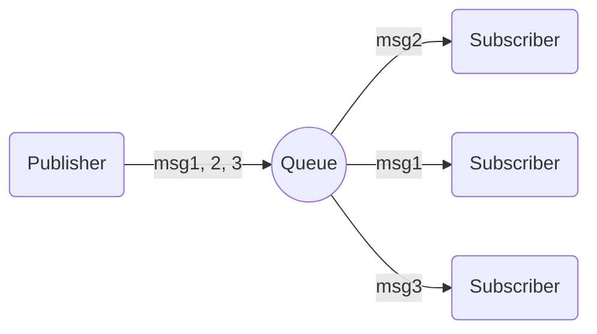

# REMS Controller Application with Message Queue

## A Simplified Example of Application Services for Residential EMS Controller Using NATS

Microservice architecture, a design approach where an application is structured as a collection of small, autonomous services, facilitates independent deployment, enhanced scalability, fault isolation, and technological diversity. However, traditional Remote Procedure Call (RPC) communication between services can result in tight coupling and synchronous communication, which may hinder scalability and resilience. To address these issues, microservices often utilize a message queue for communication. This approach enables asynchronous processing, allowing services to handle requests in parallel, thereby improving throughput. Message queues also support scalability, ensure reliable message delivery, foster loose coupling, and provide buffering capabilities.

In the context of this project, the application consists of five microservices:

- **collectionservice**: Gathers data from power electricity devices, such as BMS.
- **dataservice**: Manages the persistence of collected data.
- **cloudservice**: Uploads collected data to the cloud and synchronizes the settings of electricity devices.
- **controlservice**: Dispatches commands to configure settings on electricity devices.
- **monitorservice**: Collects operational metrics from other services.

[NATS](https://github.com/nats-io/nats.go) is employed to enhance service decoupling.

## Usage

### Compile Services

Use the provided Makefile to compile executable binaries.

* Compile the services:
  - Run `make service`.

### Launch Services

The services can be launched separately in any order.

* Launch the dataservice:
  - Run `./internal/service/dataservice/data_service`.
* Launch the collectionservice:
  - Run `./internal/service/collectionservice/collection_service`.
* Launch the cloudservice:
  - Run `./internal/service/cloudservice/cloud_service`.
* Launch the controlservice:
  - Run `./internal/service/controlservice/control_service`.
* Launch the monitorservice:
  - Run `./internal/service/monitorservice/monitor_service`.

## Overview


## Service

### collectionservice

This service acts as a simulated data source, collecting data from external power electricity devices at regular one-second intervals. It operates as a push-based message client using a publish-subscribe model, sending data to the message queue every second. Additionally, it sends operational metrics data through another push-based message model at regular intervals.

### dataservice

The dataservice functions as the datastore server. It accepts device data through a message queue using a queue-group model and saves the data in the system. For simplicity, SQLite is chosen as the persisting datastore. Additionally, it sends operational metrics data through a push-based message model at regular intervals.

### cloudservice

The cloudservice accepts device data messages from a queue-group message model and uploads it to the cloud at regular intervals. For reliability, it applies a pull-based message model to manage unsuccessful uploaded data internally and performs batched-retry at every regular interval. Besides, it also acts as an intermediate service which accepts control requests from the cloud and dispatches command requests to the controlservice through the message queue. It uses a request-reply message model to ensure the status of the incoming command. Additionally, it sends operational metrics data through another push-based message model at regular intervals.

### controlservice

The controlservice is responsible for controlling the device’s settings. It uses a request-reply message model to communicate the status of the incoming command with the requesting service. Additionally, it sends operational metrics data through another push-based message model at regular intervals.

### monitorservice

The monitorservice functions as the metric datastore, accepting the services' operational metric data through a message queue using a queue-group model to save data in the system. For simplicity, SQLite is chosen as the persisting datastore.

## NATS

This section provides an overview of how NATS is applied in microservices, citing or adjusting important terms and concepts from the official NATS documentation. For a complete explanation and detailed tutorials, please refer to the NATS [documentation](https://docs.nats.io/?_gl=1*1cvleq2*_ga*MTg0NzgyOTY1LjE3MTY0NDkwNzI).

### Core NATS

> "Core NATS" is the base set of functionalities and qualities of service offered by a NATS service infrastructure

NATS is a lightweight communication infrastructure that facilitates message exchange. NATS services are provided by interconnected NATS server processes, and NATS client applications connect to these servers to publish or subscribe to messages on specific subjects. The logical concept is depicted below.



### JestStream

> JetStream is a built-in distributed persistence system for NATS Service which enables new functionalities and higher qualities of service on top of the base 'Core NATS' functionalities and qualities of service.

Essentially, JetStream is a stream processing solution built on top of the “Core NATS” infrastructure. It enhances resilience and scalability by providing advanced features for reliable message storage, delivery, and processing.

One of the distinct functionalities provides by Jetstream is **Streaming** which facilitates temporal decoupling between the publishers and subscribers. As explained in the official document, "*The traditional way for messaging systems to provide temporal decoupling of the publishers and subscribers is through the 'durable subscriber' functionality or sometimes through 'queues'*" which requires additional effort. However, "*JetStream provides both the ability to consume messages as they are published (i.e. 'queueing') as well as the ability to replay messages on demand (i.e. 'streaming').*"

#### Streams

> **Streams** are "message stores", each stream defines how messages are stored and what the limits (duration, size, interest) of the retention are. Streams consume normal NATS subjects, any message published on those subjects will be captured in the defined storage system.

#### Subject
In JetStream, a **subject** is a lightweight, flexible identifier used to categorize and route messages. Subjects play a crucial role in the NATS messaging system, enabling efficient and dynamic communication between publishers and subscribers.

> **Note**: Although there isn't a dedicated section on "Subject" in the official documentation like there is for "Stream" or "Consumer", understanding the concept of subjects is essential for grasping the overall infrastructure of NATS.

#### Consumers

> A **consumer** is a stateful view of a stream. It acts as interface for clients to consume a subset of messages stored in a stream and will keep track of which messages were delivered and acknowledged by clients.

### Features

JetStream offers various configurations to manage message delivery guarantees and processing, including delivery semantics, message subscription methods, and persistence types.

#### Delivery Semantics

JetStream ensures "at least once" delivery, unlike core NATS' "at most once" guarantee. Messages are persisted and tracked for delivery and acknowledgment, with unacknowledged messages automatically re-delivered up to a set limit.

#### Message Subscription Methods

JetStream supports push-based consumers, which deliver messages automatically to a specified subject, and pull-based consumers, which allow clients to request messages on demand for flexibility and scalability.

#### Persistence type

Consumers can be durable, remaining active across sessions and during inactivity, or ephemeral, which are deleted after a period of inactivity when no subscriptions are present. These options provide robust and adaptable message processing.



### Message Subscription Patterns

This section summarizes the common message subscription patterns in NATS used in this project. These patterns are crucial for ensuring efficient and reliable communication between microservices, allowing for both real-time and on-demand message processing.

#### Publish-Subscribe



> NATS implements a publish-subscribe message distribution model for one-to-many communication. A publisher sends a message on a subject and any active subscriber listening on that subject receives the message. Subscribers can also register interest in wildcard subjects that work a bit like a regular expression (but only a bit).

In the publish-subscribe model, messages are broadcasted to all subscribers listening on a particular subject. This is ideal for scenarios where multiple services need to react to the same event, such as updating caches or logging activities. NATS allows subscribers to use wildcard subjects, enabling flexible and dynamic subscription patterns that can match multiple subjects with a single subscription.

#### Request-Reply



> Request-Reply is a common pattern in modern distributed systems. A request is sent, and the application either waits on the response with a certain timeout, or receives a response asynchronously.

The request-reply pattern is essential for synchronous communication between services, where a response is expected after sending a request. This pattern is useful for operations that require confirmation or additional information, such as querying a database or invoking a remote procedure. In NATS, the publisher sends a request to a subject, and one of the subscribers responds, sending the reply back to the publisher.

#### Queue Groups



> When subscribers register themselves to receive messages from a publisher, the 1:N fan-out pattern of messaging ensures that any message sent by a publisher, reaches all subscribers that have registered. NATS provides an additional feature named "queue", which allows subscribers to register themselves as part of a queue. Subscribers that are part of a queue, form the "queue group".

Queue groups enable load balancing of message processing among multiple subscribers. When subscribers join a queue group, messages published to the subject are distributed among the members of the group. This ensures that each message is processed by only one subscriber in the group, making it an excellent choice for tasks that require horizontal scaling, such as processing tasks in a worker pool or handling requests in a web server farm.

> **Note**: These patterns can be applied in both "core NATS" and JetStream. The major differences lie in JetStream's ability to enable persistent and consistent storage and support durable consumers, which provide more robust and reliable message handling capabilities.

### Options in JetStream

In this section, some of the options for streams and consumer used in the project are outlined here. For the detailed usage or explanation, please visit the official documentation.

#### Streams

| Field         | Description   | Note          |
| ------------- | ------------- | ------------- |
| Name | The unique identifier for specify the streams. | Names cannot contain whitespace, `.`, `*`, `>`, path separators (forward or backwards slash), and non-printable characters.
| Subjects | A list of subjects to bind. | Wildcards are supported. Cannot be set for mirror streams.
| Retention | Declares the retention policy for the stream. | The retention options include: `LimitsPolicy` (default), `InterestPolicy` and `WorkQueuePolicy`.
| Discard | The behavior of discarding messages when any streams' limits have been reached. | The options include: `DiscardOld` (default)and `DiscardNew`.
| MaxAge | How many messages may be in a Stream. Adheres to Discard Policy, removing oldest or refusing new messages if the Stream exceeds this number of messages |
| Storage | The storage type for stream data. | The storage types include: `File` (default) and `Memory`.
| MaxMsgsPerSubject | Limits how many messages in the stream to retain per subject. |
| MaxMsgSize | The largest message that will be accepted by the Stream |
| NoAck | Disables acknowledging messages that are received by the Stream |


#### Consumer

| Field         | Description   | Note          |
| ------------- | ------------- | ------------- |
| Durable | If set, clients can have subscriptions bind to the consumer and resume until the consumer is explicitly deleted. | A durable name cannot contain whitespace, `.`, `*`, `>,` path separators (forward or backwards slash), and non-printable characters.
| DeliverPolicy | The point in the stream to receive messages from. | The options include: `DeliverAll`, `DeliverLast`, `DeliverNew`, `DeliverByStartSequence`, `DeliverByStartTime`, or `DeliverLastPerSubject`.
| AckPolicy | The requirement of client acknowledgements. | The options include: `AckExplicit`, `AckNone`, or `AckAll`.
| AckWait | The duration that the server will wait for an ack for any individual message once it has been delivered to a consumer. If an ack is not received in time, the message will be redelivered. |
| MaxAckPending | Defines the maximum number of messages, without an acknowledgement, that can be outstanding. Once this limit is reached message delivery will be suspended. This limit applies across all of the consumer's bound subscriptions. | A value of -1 means there can be any number of pending acks (i.e. no flow control). This does not apply when the `AckNone` policy is used.

### Code Snippet Example

#### Connect to NATS server and create Jetstream context

```go
nc, err := nats.Connect(nats.DefaultURL)
if err != nil {
	return nil, err
}

js, err := nc.JetStream(nats.PublishAsyncMaxPending(256))
if err != nil {
	return nil, err
}
return &messageContext{
	nc: nc,
	js: js,
}, nil

// ... 

a.msgCtx.nc.Close()
```

#### Create a stream

```go
stream, _ := js.StreamInfo(streamName)
if stream == nil {
	if _, err := js.AddStream(&nats.StreamConfig{
		Name:              streamName,
		Subjects:          []string{streamSubject},
		Retention:         nats.InterestPolicy,
		Discard:           nats.DiscardOld,
		MaxAge:            7 * 24 * time.Hour,
		Storage:           nats.FileStorage,
		MaxMsgsPerSubject: 100_000_000,
		MaxMsgSize:        4 << 20,
		NoAck:             false,
	}); err != nil {
		return err
	}
}
```

#### Publish a message to the stream

```go
info, err := json.Marshal(metricsInfos)
if err != nil {
	// ...
}

if _, err := a.msgCtx.js.Publish(metricSubject, info); err != nil {
	// ...
} else {
	// ...
}
```

#### Create a pull-based consumer
```go
// Create pull consumer
pullSub, err := msgCtx.js.PullSubscribe(
	cloudOfflineDataSubject,
	offlineConsumerGroup,
	nats.ManualAck(),                                 // ack messages manually
	nats.Bind(cloudDataStream, offlineConsumerGroup), // bind consumer to the stream
	nats.Context(a.agentCtx.ctx),                     // use context to cancel the subscription
)
if err != nil {
	return err
}
a.msgCtx.offlineDataSub = pullSub

// ...
  
a.msgCtx.offlineDataSub.Unsubscribe()

// ...

// Fetch and process messages
msg, err := a.msgCtx.offlineDataSub.Fetch(60, nats.MaxWait(5*time.Second))
if err != nil {
	...
}
	
for _, m := range msg {
	var info model.BmsInfo
	err := json.Unmarshal(m.Data, &info)
	if err != nil {
		// ...
	}
	if err := a.cloudClient.PubRawdata(&info); err == nil {
		m.Ack()
	} else {
		// ...
	}
}
```

#### Create a queue-subscribed consumer
```go
_, err := a.msgCtx.js.QueueSubscribe(rawdataSubject, consumerGroup, func(msg *nats.Msg) {
    if string(msg.Data) == "null" {
      return
    }
  
    var info model.BmsInfo
    err := json.Unmarshal(msg.Data, &info)
    if err != nil {
      // ...
    }
  
    err = msg.Ack()
    if err != nil {
      // ...
      return
    }
	
    if info != (model.BmsInfo{}) {
      select {
        case batInfos <- &info:
          // ...
        case <-a.agentCtx.ctx.Done():
          return
      }
    }
  })

// ...
```
